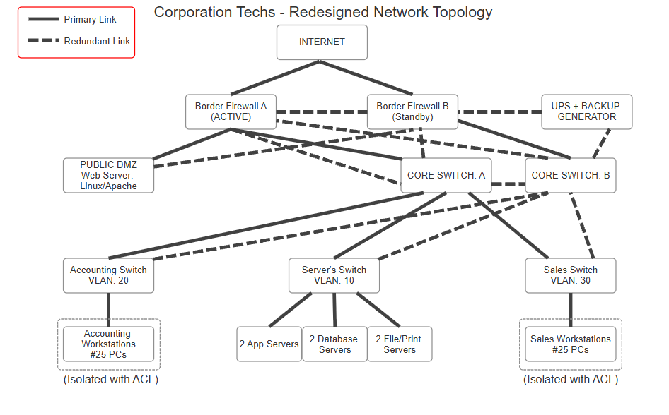

# Enterprise Network Architecture & Security Redesign

**Author:** Sebastian Romo  
**Repository:** Enterprise Network Redesign Project  

---

## Executive Summary

Corporation Techs originally operated on a flat, unsegmented network architecture where 50 employee workstations, internal database/application servers, and a public-facing web server shared a single broadcast domain. This structural flaw left critical business databases vulnerable to lateral movement in the event of a public web server compromise[cite: 5]. 

This project delivers a complete enterprise network redesign that isolates public infrastructure, enforces department-level VLAN micro-segmentation, eliminates single points of failure across all layers, and integrates a hybrid dual-stack IPv4/IPv6 addressing schema[cite: 5].

---

## Legacy Infrastructure Bottlenecks

Prior to the redesign, the network environment lacked modern security controls and redundancy[cite: 5]:

* **Workstations:** 50 Windows endpoints (split between Sales and Accounting) on an unsegmented LAN[cite: 5].
* **Application & Data Tier:** 2 Windows Application Servers, 2 Windows Database Servers, 2 File/Print Servers[cite: 5].
* **Perimeter Services:** 1 Linux/Apache Public Web Server directly exposed on the internal network[cite: 5].
* **Network Fabrics:** Unmanaged switches without VLAN tagging; single border firewall connecting to a single ISP connection[cite: 5].

---

## Proposed Topology & Security Architecture

### 1. Physical Layer & Edge Redundancy
The environment utilizes a layered hierarchical model (Core and Access layers) featuring end-to-end hardware redundancy[cite: 5]:
* **Perimeter High Availability:** Active/Standby border firewall pair connected to two independent Internet Service Providers (ISPs) to prevent WAN link outages[cite: 5].
* **Core Switch Cluster:** Dual cross-linked core switches providing redundant uplinks to every department access switch, mitigating hardware switch failures[cite: 5].

### 2. Logical Segmentation (VLANs & Access Control Lists)
To prevent lateral movement between departments, endpoints are isolated into dedicated Virtual LANs mapped across access switches[cite: 5]:
* **VLAN 10 (Shared Infrastructure):** Application, Database, and File/Print servers[cite: 5].
* **VLAN 20 (Accounting Department):** 25 Accounting Workstations[cite: 5].
* **VLAN 30 (Sales Department):** 25 Sales Workstations[cite: 5].

*Inter-VLAN Routing & Security Policy:* Routing between VLANs is governed by stateful Access Control Lists (ACLs) applied at the core layer[cite: 5]. ACLs permit both Accounting and Sales endpoints to access shared corporate applications in VLAN 10 and output to the internet, but strictly block direct peer-to-peer traffic between VLAN 20 and VLAN 30[cite: 5].

### 3. Public DMZ Isolation
To isolate public internet traffic, the Linux/Apache web server is hosted on a dedicated Demilitarized Zone (DMZ) interface directly off the border firewall pair[cite: 5].
* **Inbound Policy:** Inbound firewall rules permit only `HTTP` (TCP 80) and `HTTPS` (TCP 443) traffic originating from the public internet[cite: 5].
* **Outbound Policy:** All egress connections initiated from the DMZ toward internal corporate subnets (VLANs 10, 20, 30) are dropped by default[cite: 5].

---

## 24/7 Availability & Disaster Recovery Plan

| Component | Redundancy Strategy |
| :--- | :--- |
| **WAN & Edge** | Dual-ISP links feeding an Active/Standby firewall failover cluster[cite: 5]. |
| **Switching Fabric** | Dual cross-linked Core Switches with redundant trunking to Access Switches[cite: 5]. |
| **Power Infrastructure** | Rack-mounted Uninterruptible Power Supplies (UPS) paired with an on-site backup generator[cite: 5]. |
| **Data Integrity** | Daily automated local backups combined with encrypted off-site cloud replication[cite: 5]. |
| **Proactive Operations**| Real-time SNMP monitoring and Syslog centralized logging for early fault detection[cite: 5]. |

---

## IP Addressing Strategy: Dual-Stack Implementation

* **Internal Subnets:** Maintained on standard private IPv4 addressing (RFC 1918) to avoid unnecessary administrative complexity across local endpoints[cite: 5].
* **Public DMZ:** Configured with a **Dual-Stack (IPv4/IPv6)** architecture[cite: 5]. Enabling IPv6 on the public web server ensures uninterrupted connectivity for global IPv6 web traffic without exposing internal subnets to dual-stack routing overhead[cite: 5].

---

## Network Architecture Diagram

[cite: 5]

---

## Standards & References

* Cisco Press. (2005). *CCDP self-study: Designing high-availability services.*[cite: 5]
* Ford, M. (2026). *18 years later, IPv6 reaches majority.* Internet Society Pulse.[cite: 5]
* National Institute of Standards and Technology. (2010). *Guidelines for the Secure Deployment of IPv6* (NIST SP 800-119).[cite: 5]
* Scarfone, K., & Hoffman, P. (2009). *Guidelines on Firewalls and Firewall Policy* (NIST SP 800-41, Rev. 1).[cite: 5]
